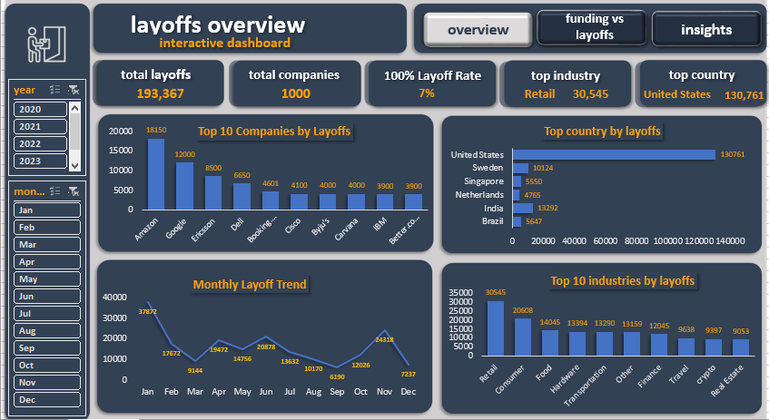
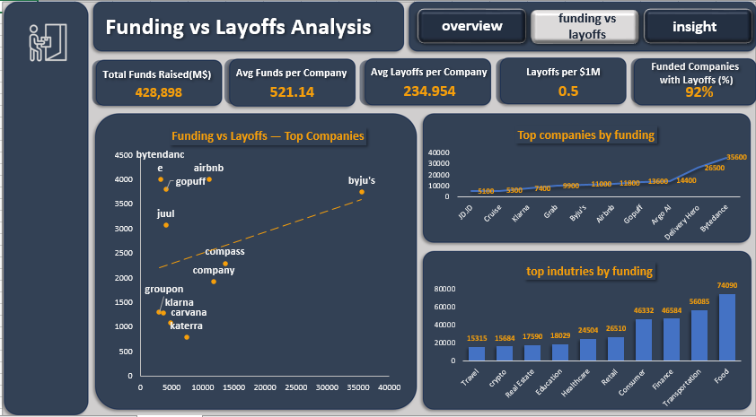
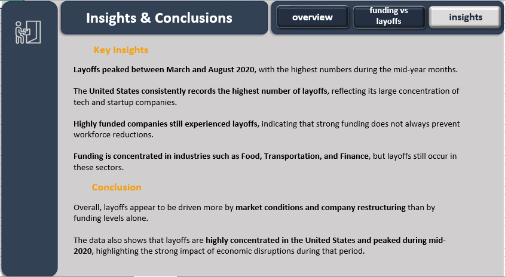

# Layoffs Data Cleaning & Exploratory Data Analysis (SQL)

## 📌 Project Overview
This project presents an end-to-end data analytics workflow applied to a global layoffs dataset.

It covers data cleaning and transformation using SQL, exploratory data analysis to identify trends and patterns, and the development of interactive dashboards in Excel and Power BI.

The goal is to analyze layoffs by company, industry, country, and time, and to explore the relationship between funding and layoffs to derive meaningful business insights.

This is an end-to-end data analytics project covering data cleaning, exploratory analysis, and interactive dashboard development using SQL, Excel, and Power BI.
---

## 🛠 Tools & Technologies
- MySQL 8.0
- SQL (CTEs, Window Functions, Aggregations)
- Microsoft Excel (Dashboard & Analysis)
- Power BI (Interactive Dashboard)
- GitHub (Version Control)

---

## 📂 Project Structure

- layoffs_raw.csv — original dataset  
- data_cleaning_layoffs.sql — SQL cleaning script  
- exploratory_data_analysis_layoffs.sql — SQL EDA queries  
- layoffs_dashboard.xlsx — Excel interactive dashboard  
- powerbi_dashboard.pbix — Power BI dashboard  
- images/ — dashboard screenshots & demo  
- README.md — project documentation  

## 📊 Data Source
The dataset is a public layoffs dataset containing company-level information such as industry, location, company stage, funding, and layoff dates.

## 🧹 Data Cleaning Steps
- Removed duplicates
- Standardized company and industry names
- Handled missing and null values
- Converted date fields to proper date format
- Validated numerical fields

## 🔍 Exploratory Data Analysis (EDA)
- Identified companies with the highest total and percentage of layoffs  
- Analyzed layoffs by industry and country  
- Examined layoffs across company funding levels and stages  
- Investigated trends over time (yearly and monthly)  
- Ranked top companies by annual layoffs

## 📊 Dashboards

### Excel Dashboard
- Interactive dashboard using Pivot Tables, Charts, and Slicers  
- Includes:
  - Layoffs overview  
  - Funding vs layoffs analysis  
  - Key insights  

### Power BI Dashboard (Coming Soon)
- This section will include an interactive Power BI dashboard  
- To be added in the next update
  
## 📸 Dashboard Preview

### Overview

### Funding vs Layoffs

### Insights

## 🎥 Dashboard Interaction

## 🚀 Future Improvements
- Develop an interactive dashboard using Power BI
- Enhance data modeling and visualization
- Add more advanced metrics and KPIs

## 📌 Key Insights

- Layoffs peaked between March and August 2020  
- The United States accounts for the highest number of layoffs  
- Highly funded companies still experienced layoffs  
- Funding is concentrated in a few industries, yet layoffs persist

## 🔄 Data Pipeline

1. Raw dataset (CSV)
2. Data cleaning and transformation using SQL (MySQL)
3. Exploratory Data Analysis (SQL)
4. Data export for visualization
5. Dashboard development in Excel and Power BI
